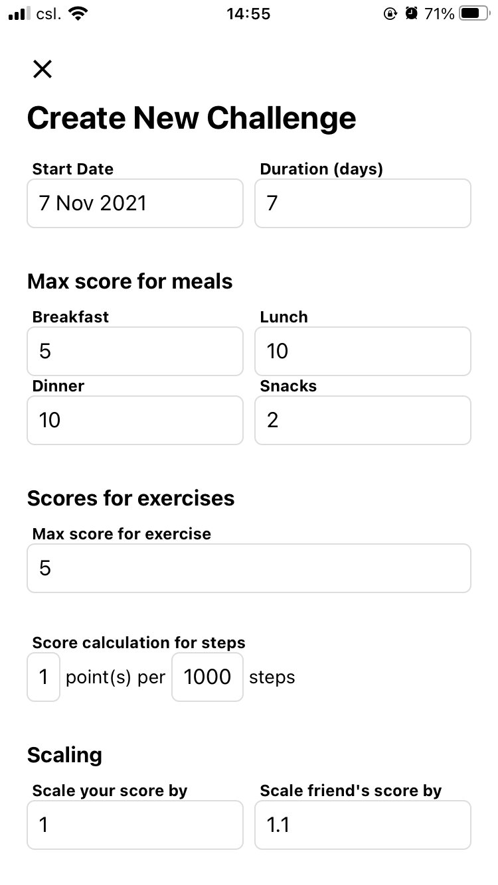
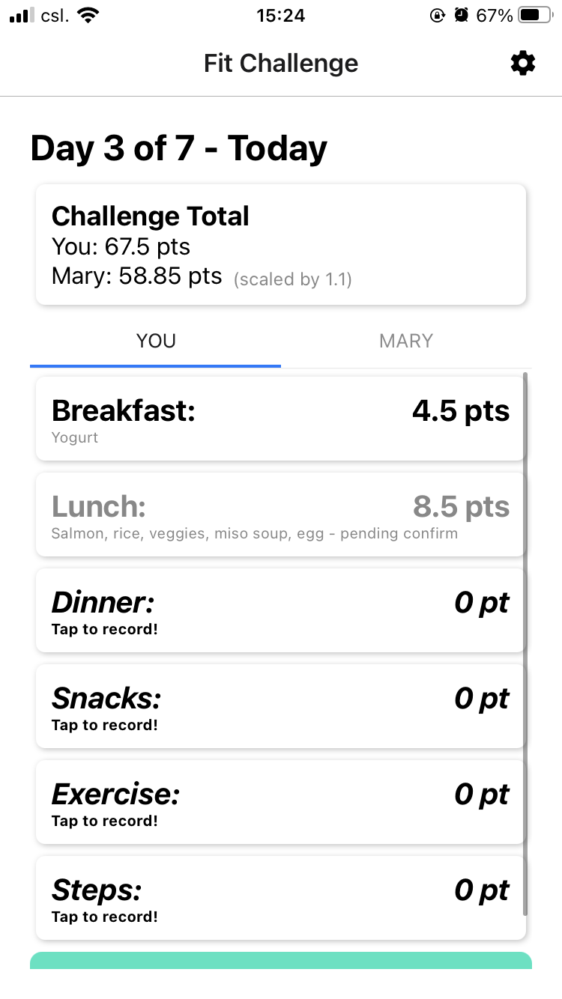
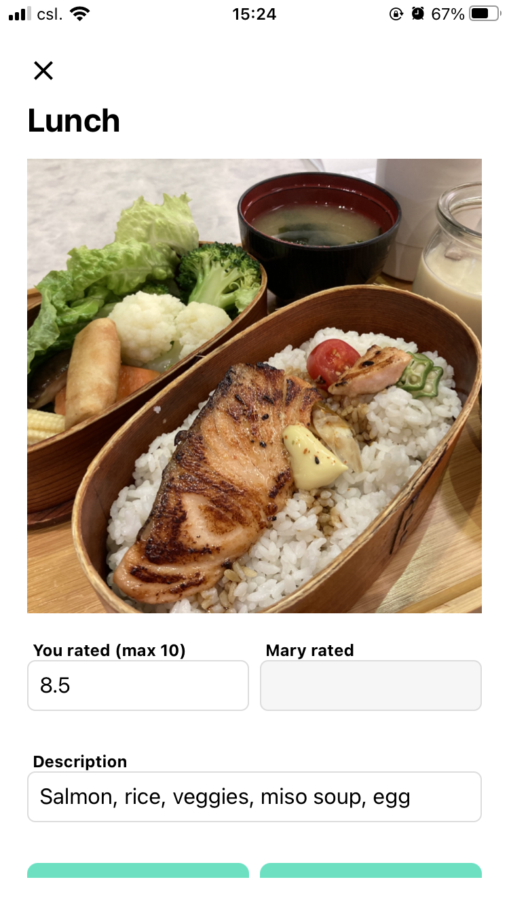
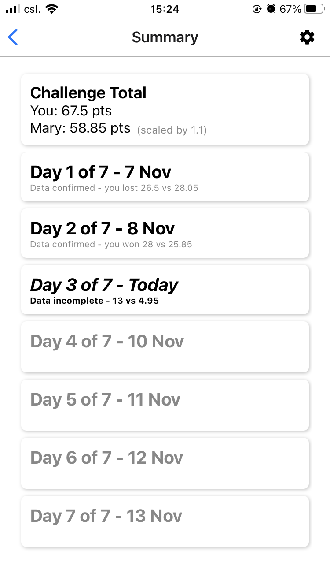
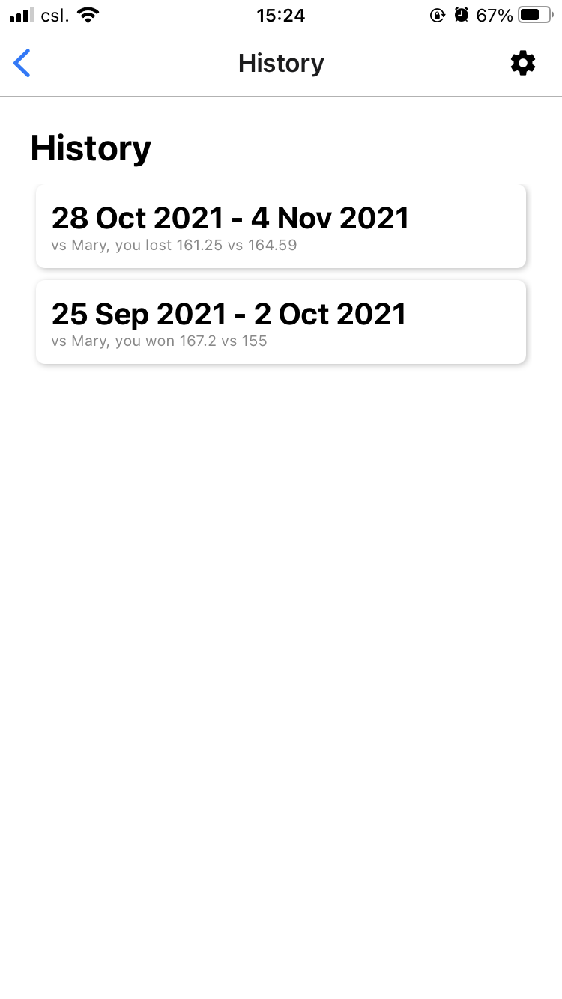
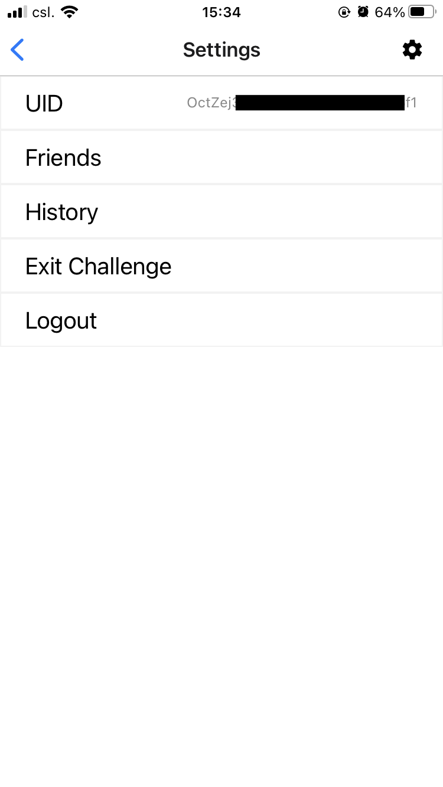
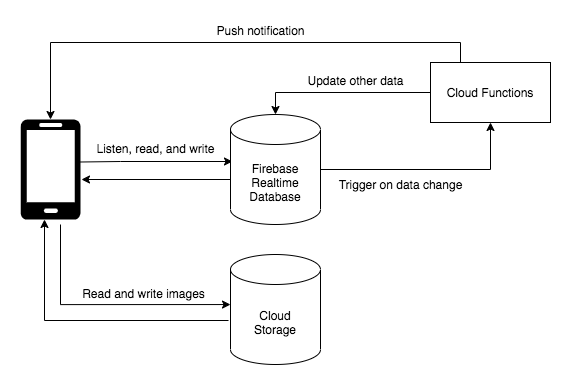

# fit-challenge-app
A mobile application to gamify healthy lifestyle in the form of challenges between friends.
- Compete to stay healthy
- Supports customizations to help users with less healthy lifestyle to catch up gradually

## How it works
- Each challenge is one-on-one and lasts several days
- Every day, the participants record what they ate, what exercise they did, and how many steps they walked
- Each item is scored based on how healthy it is
  - For each meal and exercise, the user can upload a photo and a text description, 
  then both participants give a score to the item and the average score becomes the item's final score
  - Number of steps is scored by a user-defined formula like "1 point per 1000 steps", 
    - Score is rounded down to encourage walking extra steps when the number is close to the next cutoff (e.g. 3800 -> walk extra 200 steps to make it 4000)
- Scores are cumulated over the period of the challenge. The person with the higher score when the challenge ends is the winner

## Highlights
- Score calculation is customizable
  - A participant can get an advantage by having their scores scaled up by a factor (e.g. x1.1)
    - This levels the playing field for users with less healthy lifestyles so that they can gradually catch up with friends
    - **This is the key motivation behind building this app** for my friend and myself since I can't find similar features in existing challenge apps
  - Importance of each meal is determined by its max score
    - e.g. if I think lunch is more important than breakfast, I can set the max score for lunch to be 10 and that for breakfast to be 5, 
    so a healthy lunch (e.g. 9 points) will have a bigger impact on the total score than a healthy breakfast (e.g. 4.5 points)
  - Formula for step calculation is also customizable
- Learn about one another's view on what a healthy lifestyle is
  - Each item is scored by both participants. This scoring method cancels out differences in scoring standards and encourages discussion regarding how healthy a meal/exercise is
- Share the joy of one another's success
  - Look at the photos and cheer for your friend when they have a healthy meal :)

## How it looks

  
  &nbsp;&nbsp;&nbsp;&nbsp;
  
  &nbsp;&nbsp;&nbsp;&nbsp;
  

  
  &nbsp;&nbsp;&nbsp;&nbsp;
   
  &nbsp;&nbsp;&nbsp;&nbsp;
  

## About the system

- Serverless
- Client interacts directly with Firebase Realtime Database, which stores a JSON tree
  - The database rules (./server/rules/realtime-database-rules.txt) determine what contents each user has access to
  - Client sets up listeners to synchronize and respond to updates in real time (e.g. update scores after a friend records a meal)
- Cloud Functions are triggered by data change on certain database locations (on the JSON tree)
  - e.g. calculate total scores and save in summary after a user records a meal, archive a challenge after both participants quit, etc.
- A Cloud Function pushes notifications to users after their friend records a meal so that the user can give a score

## Notes
- Currently deployed on Expo Go and used by a friend and myself
